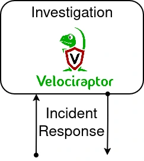

## Introduction
[Velociraptor](https://docs.velociraptor.app/) is an advanced digital forensic and incident response tool that enhances your visibility into your endpoints.



## Directory Explanation

**base/secrets:** Config files for secrets, in this case credentials for velociraptor.

**base/config:** Installation and startng files for velociraptor server and clients.

## How To Run Locally

```bash
kubectl apply -k overlays/local

<SNIP>

kubectl -n velociraptor port-forward service/velociraptor 8889:8889
```

The server should be accessible on [localhost:8889](https://localhost:8889) with **admin:admin**.

## Velociraptor Clients

| Type        | Download Link                                                  |
| ----------- | -------------------------------------------------------------- |
| Windows MSI | https://localhost:8889/clients/windows/velociraptor_client.msi |
| Windows EXE | https://localhost:8889/clients/windows/velociraptor_client.msi |
| Mac         | https://localhost:8889/clients/mac/velociraptor_client         |

## Requirements

| Software                         | Link                                          |
| -------------------------------- | --------------------------------------------- |
| Kubernetes                       | https://kubernetes.io/                        |
| kubectl                          | https://kubernetes.io/docs/reference/kubectl/ |
| kustomize                        | https://kustomize.io/                         |
| minikube (for local development) | https://minikube.sigs.k8s.io/                 |