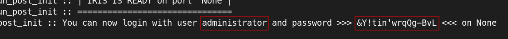

## Introduction
[IRIS](https://dfir-iris.org/) is a collaborative platform aiming to help incident responders to share technical details during investigations.


## Directory Explanation

**base/config:** Contains shell script which starts iris installation inside the container. 

**base/iris_app:** Contains deployment scripts for the iris containers. 

**base/rabbitmq:** Contains deployment files for rabbitmq. 

**base/secrets:** Config files for secrets, in this case creds for postgres and iris itself.

**datastore:** Config files for postgresql.

## How To Run Locally

```bash
kubectl apply -k overlays/local

<SNIP>

kubectl -n iris port-forward service/iris-app 8000:8000
```

The server should be accessible on [localhost:8000](http://localhost:8000).

The credentials are generated from the iris app, they can be found by running the command:

```bash
kubectl logs iris-app-0 -n iris
```

Example:



## Requirements

| Software                         | Link                                          |
| -------------------------------- | --------------------------------------------- |
| Kubernetes                       | https://kubernetes.io/                        |
| kubectl                          | https://kubernetes.io/docs/reference/kubectl/ |
| kustomize                        | https://kustomize.io/                         |
| minikube (for local development) | https://minikube.sigs.k8s.io/                 |