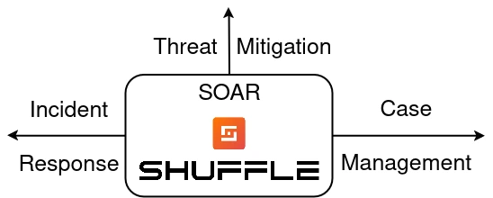

## Introduction
[Shuffle](https://shuffler.io/) is an open source Security Orchestration, Automation, and Response platform, also known as a SOAR, that allows you to collect, enrich, automate, and respond to security events with little to no human interaction required.



## Directory Explanation

**base/backend:** Deployment files for the shuffle backend.

**base/frontend:** Deployment files for the shuffle frontend.

**base/orborus:** Deployment files for the shuffle orborus, something like a controller which polls for jobs and creates and assigns workers for them.

## How To Run Locally

```bash
./certs/generate_certs.sh

<SNIP>

kubectl apply -k overlays/local

<SNIP>

kubectl -n shuffle port-forward service/shuffle-frontend 8000:80
```

The server should be accessible on [localhost:8000](https://localhost:8000). You will be asked to create the admin user, after which you are free to use the app.

## Requirements

| Software                         | Link                                          |
| -------------------------------- | --------------------------------------------- |
| Kubernetes                       | https://kubernetes.io/                        |
| kubectl                          | https://kubernetes.io/docs/reference/kubectl/ |
| kustomize                        | https://kustomize.io/                         |
| minikube (for local development) | https://minikube.sigs.k8s.io/                 |